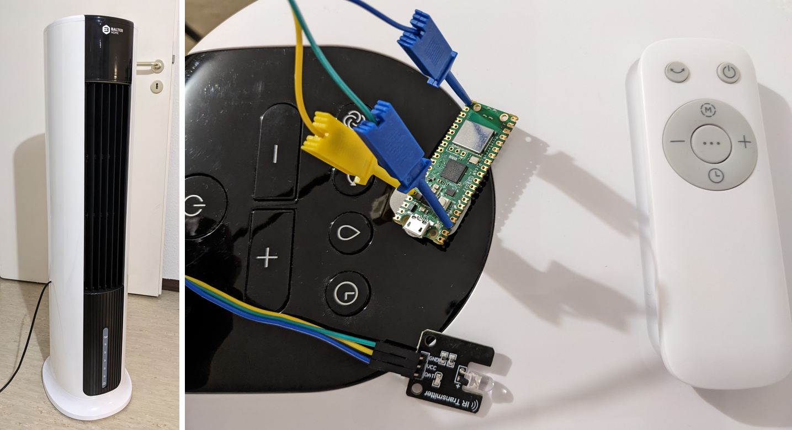

# tower-fan-irbridge

I have a tower fan (Balter VT-05 4-in-1 Tower Fan with Water Cooling) and would like to integrate it with my current home automation.
The only interface to the fan is the remote control or the dashboard in the fan itself, so the easiest way for me is to connect it to create a wifi bridge, so I can send HTTP get requests and they will be turned into IR commands.




In this build I used:
- Raspberry Pi Pico W
- IR Transmitter (iHaospace Digital 38 khz IR Transmitter - I used a IR receiver as well to discover my remote control commands)
- power supply to the Pico

## Choosing an IDE
To use Arduino IDE to program the RP2040 I installed a new board manager:
 https://github.com/earlephilhower/arduino-pico/releases/download/global/package_rp2040_index.json

After that I could choose the `Raspberry Pi Pico/RP2040 by Earle F...` in the board manager and I was able to program the RPi Pico W from the Arduino IDE.

## Step 1: Read the IR codes from the remote
The `IRremote` library has an example called.
Using the IR Rx sensor and the [ReceiveDemo](ReceiveDemo/ReceiveDemo.ino) example from the `IRremote` library, I could extract all the IR codes from my remote control over the Serial.
The commands (top to bottom, left to write) are the following:
- swing
    - Protocol=PulseDistance Raw-Data=0xEC13 48 bits LSB first
    - Send with:
        ```c
        uint32_t tRawData[]={0xEC13FE01, 0xEC13};
        IrSender.sendPulseDistanceWidthFromArray(38, 8850, 4400, 600, 1600, 600, 500, &tRawData[0], 48, PROTOCOL_IS_LSB_FIRST, <RepeatPeriodMillis>, <numberOfRepeats>);
        ```

- power
    - Protocol=PulseDistance Raw-Data=0xFC03 48 bits LSB first
    - Send with:
        ```c
        uint32_t tRawData[]={0xFC03FE01, 0xFC03};
        IrSender.sendPulseDistanceWidthFromArray(38, 8900, 4350, 600, 1600, 600, 500, &tRawData[0], 48, PROTOCOL_IS_LSB_FIRST, <RepeatPeriodMillis>, <numberOfRepeats>);
        ```

- mode
    - Protocol=PulseDistance Raw-Data=0xF00F 48 bits LSB first
    - Send with:
        ```c
        uint32_t tRawData[]={0xF00FFE01, 0xF00F};
        IrSender.sendPulseDistanceWidthFromArray(38, 8900, 4400, 600, 1600, 600, 500, &tRawData[0], 48, PROTOCOL_IS_LSB_FIRST, <RepeatPeriodMillis>, <numberOfRepeats>);
        ```

- minus
    - Protocol=PulseDistance Raw-Data=0xEE11 48 bits LSB first
    - Send with:
        ```c
        uint32_t tRawData[]={0xEE11FE01, 0xEE11};
        IrSender.sendPulseDistanceWidthFromArray(38, 8850, 4400, 550, 1650, 550, 550, &tRawData[0], 48, PROTOCOL_IS_LSB_FIRST, <RepeatPeriodMillis>, <numberOfRepeats>);
        ```

- dots
    - Protocol=PulseDistance Raw-Data=0xD22D 48 bits LSB first
    - Send with:
        ```c
        uint32_t tRawData[]={0xD22DFE01, 0xD22D};
        IrSender.sendPulseDistanceWidthFromArray(38, 8850, 4400, 550, 1650, 550, 550, &tRawData[0], 48, PROTOCOL_IS_LSB_FIRST, <RepeatPeriodMillis>, <numberOfRepeats>);
        ```

- plus
    - Protocol=PulseDistance Raw-Data=0xF20D 48 bits LSB first
    - Send with:
        ```c
        uint32_t tRawData[]={0xF20DFE01, 0xF20D};
        IrSender.sendPulseDistanceWidthFromArray(38, 8900, 4400, 600, 1600, 600, 500, &tRawData[0], 48, PROTOCOL_IS_LSB_FIRST, <RepeatPeriodMillis>, <numberOfRepeats>);
        ```

- clock
    - Protocol=PulseDistance Raw-Data=0xF40B 48 bits LSB first
    - Send with:
        ```c
        uint32_t tRawData[]={0xF40BFE01, 0xF40B};
        IrSender.sendPulseDistanceWidthFromArray(38, 8850, 4400, 600, 1600, 600, 550, &tRawData[0], 48, PROTOCOL_IS_LSB_FIRST, <RepeatPeriodMillis>, <numberOfRepeats>);
        ```

## Step 2: Transmit the IR codes read before
There a example called [Wifi example](rpi-server/rpi-server.ino). I modified it to add a request for each one of the commands. See the `rpi-server.ino`

I used GPIO 16 to connect the IR transmiter data pin.

### mywificredentials.h
This file is not present in the repo because contains private information of the wifi network. An example of its contents is below.
```c
#ifndef MY_WIFI_CREDENTIALS_INCLUDED
#define MY_WIFI_CREDENTIALS_INCLUDED

#define STASSID "mywifinamehere"
#define STAPSK "passwordhere"

#endif
```

## Step 3: Final assembly
TBD

## Limitations:
This build has no feedback from the commands it gives (the tower beeps after every command, but this is not captured by the RPi Pico).
Since in my build the sensor is very close to the fan receiver, it never misses a command, so it is not a real issue yet.